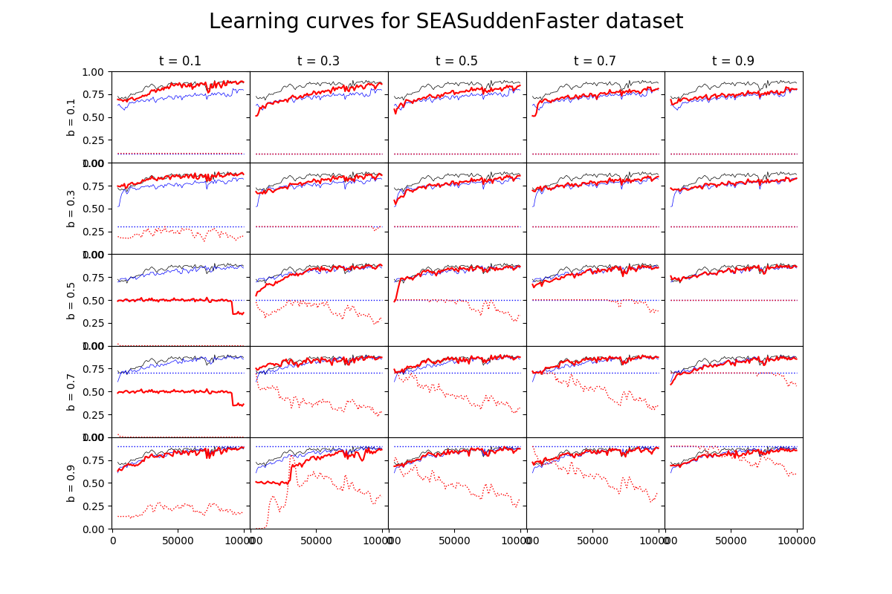
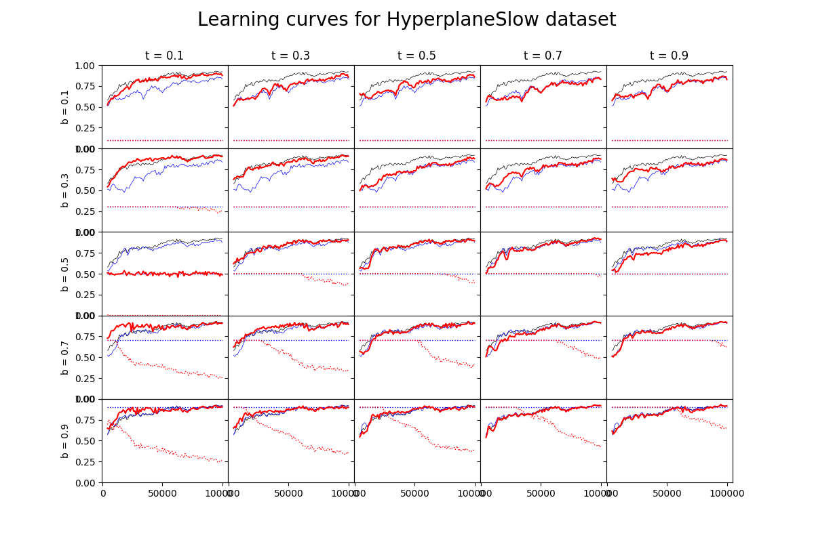
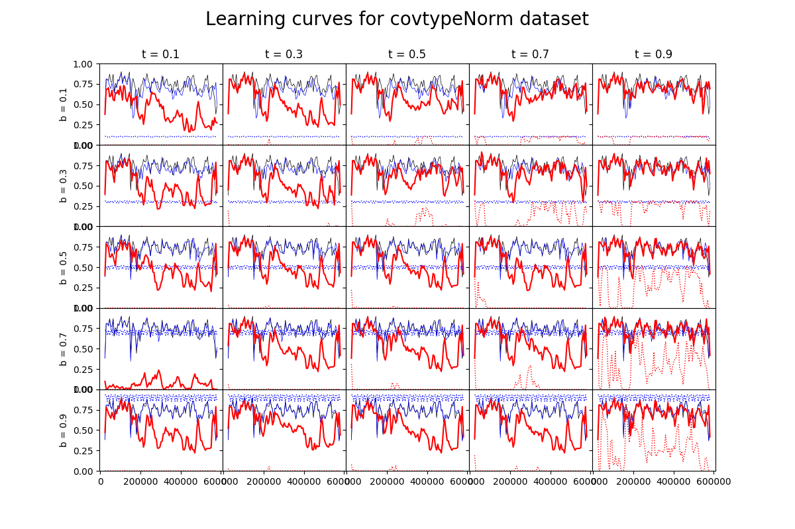
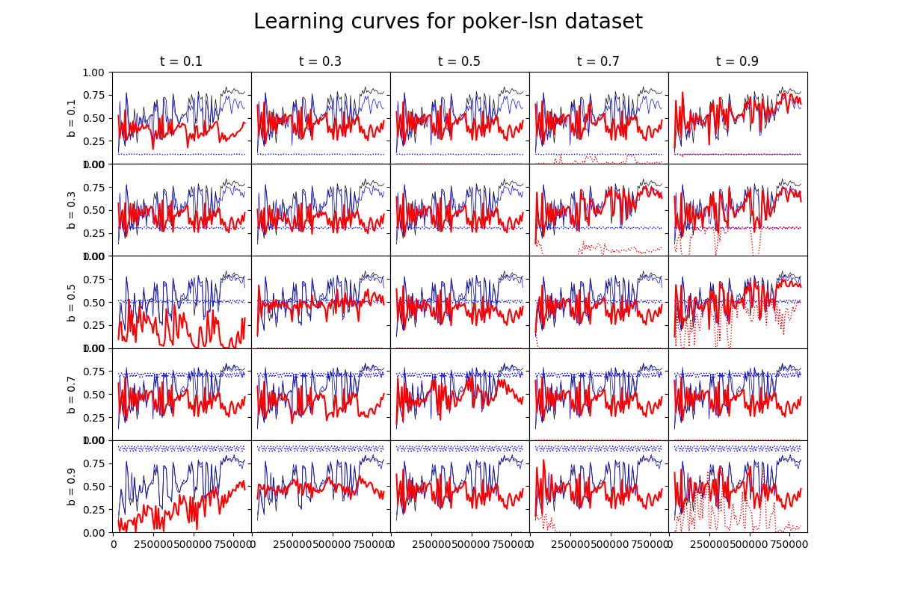

# README

<!--
Pozytywny wpływ na jakość klasyfikacji (a również na dynamikę krzywej uczenia) mają zarówno liczba neuronów w warstwie ukrytej (im więcej tym lepiej), jak i liczba próbek znajdujących się w pojedynczym chunku (im mniej tym lepiej).

Bujda: Zmniejszenie wielkości chunka wpływa też negatywnie na stabilność wyniku.
-->
